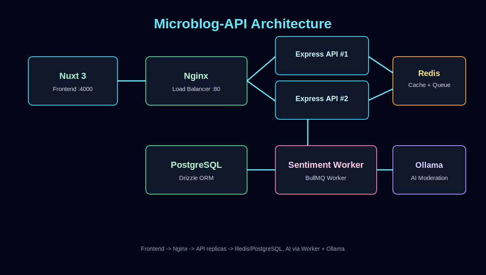
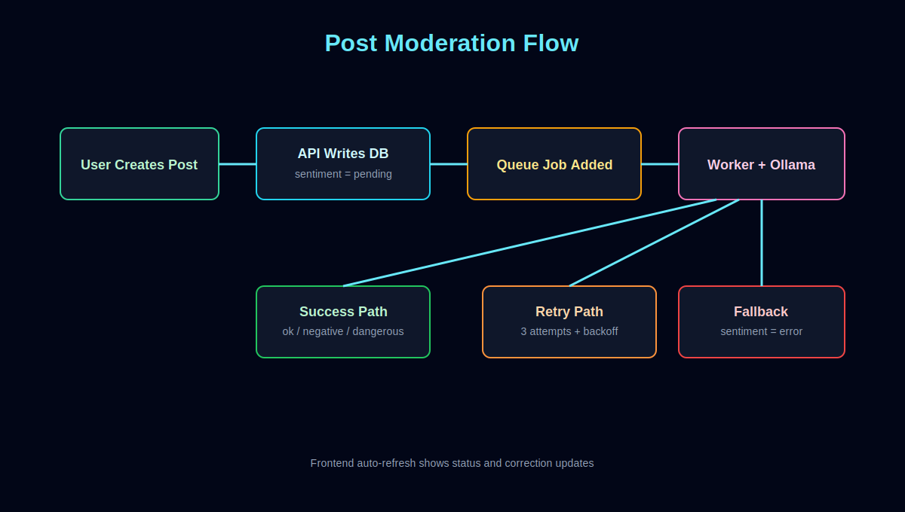
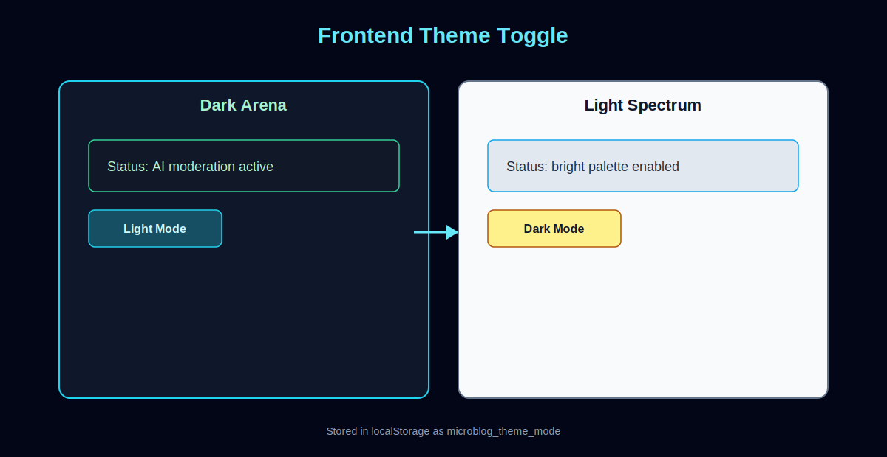

# Microblog-API

Microblog-API ist ein Fullstack-Microblog-Projekt mit Nuxt-Frontend, Express-API, PostgreSQL, Redis/BullMQ und Ollama-basierter AI-Moderation.

## Projekt-Highlights

- Login/Register mit JWT-Authentifizierung
- Feed mit Create/Edit/Delete
- AI-Moderation pro Post (ok, negative, dangerous)
- KI-Korrekturtext im Frontend sichtbar
- Queue-basierte Analyse mit Retry/Fallback
- Light-Mode-Toggle im Frontend
- Docker-Setup mit Nginx Load Balancer und API-Replikaten

## Bilder







## Architektur

- Frontend: Nuxt 3 + Vue 3 + TailwindCSS
- Backend: Express (TypeScript)
- ORM/DB: Drizzle + PostgreSQL
- Queue/Cache: BullMQ + Redis
- AI: Ollama (Sentiment + Korrektur)
- Infra: Docker Compose + Nginx + Prometheus + Grafana

## Verwendete Tools und warum

- Bun: Runtime + Package Management fuer schnellen TypeScript/JS-Workflow
- Nuxt: Meta-Framework fuer Vue mit Routing und modernem DX
- TailwindCSS: Utility-first Styling fuer schnelles UI-Iterieren
- Express: leichtgewichtiges API-Framework
- Drizzle ORM: typsichere DB-Queries und Schema-Management
- PostgreSQL: relationale Kern-Datenbank
- Redis: Caching und Queue-Backend
- BullMQ: asynchrone Job-Verarbeitung (AI-Moderation)
- Ollama: lokale/Container-basierte LLM-Ausfuehrung
- Nginx: Reverse Proxy + Load Balancer
- Prometheus/Grafana: Basis-Monitoring

## Installation (Docker, empfohlen)

Voraussetzungen:

- Docker Desktop
- Git

Schritte:

1. Repository klonen.
2. Im Projektordner starten:

```bash
docker compose down
docker compose up -d --build
```

3. Datenbankschema anwenden:

```bash
bunx drizzle-kit push
```

4. Anwendung oeffnen:

- Frontend: http://localhost:4000
- API via Nginx: http://localhost
- Redis UI: http://localhost:8001
- Grafana: http://localhost:3100

Optionales AI-Modell laden:

```bash
docker exec -it ollamaforminitwitter ollama pull tinyllama
```

## Installation (lokale Entwicklung ohne Full Docker)

Voraussetzungen:

- Bun
- Node-kompatible Umgebung
- laufende PostgreSQL/Redis/Ollama-Instanzen

Backend:

```bash
bun install
bunx drizzle-kit push
bun run src/app.ts
```

Frontend:

```bash
cd frontend
bun install
bun run dev
```

## Wichtige Compose-Services

- db: PostgreSQL
- redis: Cache + Queue Backend
- minitwitter-1 / minitwitter-2
- sentiment-worker: BullMQ Worker fuer AI-Moderation
- ollama: LLM-Service
- load-balancer: Nginx fuer API-Zugriff
- frontend: Nuxt-App
- prometheus / grafana: Monitoring

## AI-Moderation Verhalten

Beim Erstellen oder Bearbeiten eines Posts:

1. Post wird mit sentiment = pending gespeichert.
2. Queue-Job wird erzeugt.
3. Worker analysiert Text ueber Ollama.
4. Ergebnis wird als sentiment + correction gespeichert.
5. Bei mehreren Fehlschlaegen wird sentiment = error gesetzt.

Damit bleiben Flags nicht dauerhaft auf pending stehen.

## Frontend Theme Toggle

- Im Header gibt es einen Button fuer Light/Dark-Umschaltung.
- Theme wird in localStorage unter microblog_theme_mode gespeichert.
- Die Umschaltung wirkt global auf das Arena-Layout.

## Nuetzliche Befehle

```bash
# Container neu bauen/starten
docker compose up -d --build

# Logs ansehen
docker compose logs -f

# Drizzle Schema pushen
bunx drizzle-kit push

# Frontend lokal starten
cd frontend && bun run dev
```

## Projektstruktur (vereinfacht)

```text
src/
  app.ts
  routes/
  message-broker/
  microservices/
  db/

frontend/
  app/
    pages/
    components/
    composables/

docs/images/
  architecture-overview.svg
  api-flow.svg
  theme-toggle-preview.svg
```

## Hinweis

Die Dokumentation ist auf den aktuellen Stand der Codebasis angepasst (inkl. Feed-Redesign, AI-Korrekturanzeige und Theme-Toggle).